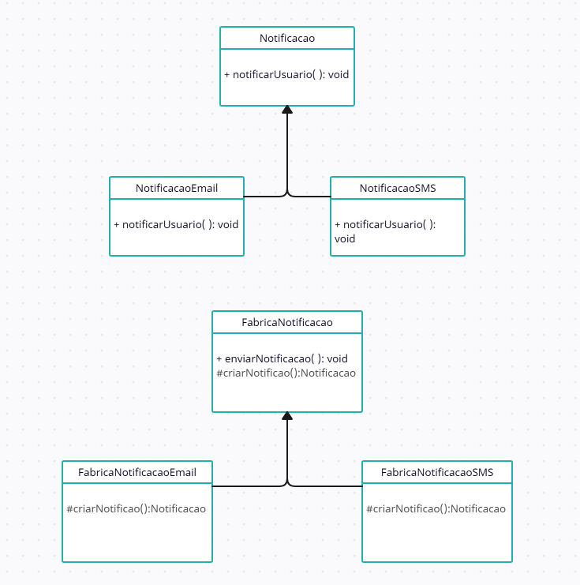
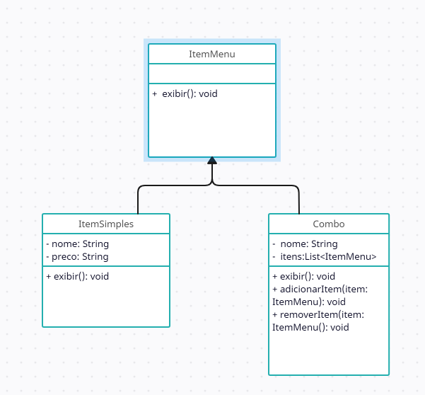
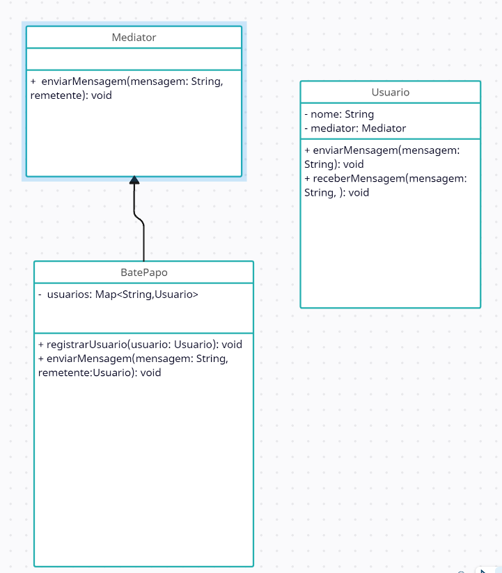

# Padrão Criacional - Factory Method

O padrão Factory Method encapsula a lógica de criação de objetos complexos, permitindo a abstração da criação de instâncias de classes. Esse padrão oferece uma maneira de delegar a responsabilidade de instanciar objetos para subclasses ou classes específicas, promovendo um design mais flexível e desacoplado.

### Explicação do Código
 - [**Código Submetido**](https://github.com/guilhermefogacadev/BCC3004-Padrao-Projeto/blob/main/criacional.java)
- **Interface Notificacao**: Define o contrato para as diferentes formas de notificação.

- **Classes Concretas NotificacaoEmail e NotificacaoSMS**: Implementam a interface `Notificacao`, representando diferentes tipos de notificação.

- **Classe Abstrata FabricaNotificacao**: Define o método `enviarNotificacao` que encapsula a criação e uso da notificação e
Declara o método abstrato `criarNotificacao` para ser implementado pelas subclasses.

 - **Classes Concretas FabricaNotificacaoEmail e FabricaNotificacaoSMS**: Extendem a classe abstrata `FabricaNotificacao` e implementam o método `criarNotificacao` para retornar o tipo específico de notificação.
 
 
 
# Padrão Estrutural - Composite

O  Composite e facilita o trabalho com objetos organizados em uma estrutura de árvore. Ele permite o tratamento de  objetos individuais quanto os grupos de objetos de maneira uniforme. Ou seja , com esse padrão  pode lidar com toda a árvore de objetos como se fosse um único objeto, sem precisar se preocupar com as diferenças entre um objeto individual e um grupo de objetos agrupados. Permite tratar itens individuais e combinações de itens( Combo) de maneira uniforme.

### Explicação do Código

- [**Código Submetido**](https://github.com/guilhermefogacadev/BCC3004-Padrao-Projeto/blob/main/estrutural.java)
- **Interface ItemMenu**: Define o método exibir para mostrar informações sobre o item do menu.

- **Classe ItemSimples**: Representa um item simples do menu, como um prato ou bebida. Implementa exibir para mostrar o nome e o preço do item.

- **Classe Combo**: Representa um combo que pode incluir outros itens de menu ou combos. Implementa exibir para mostrar o nome do combo e os itens que ele contém.
 

# Padrão Comportamental - Mediator

O  Mediator é um padrão comportamental que ajuda a reduzir a complexidade das interações entre objetos, evitando que eles se comuniquem diretamente. Em vez de objetos interagirem uns com os outros diretamente, eles se comunicam através de um objeto mediador. Esse mediador gerencia e redireciona as comunicações entre os objetos, oferecendo um acoplamento e uma estrutura mais organizada.

### Explicação do Código

- [**Código Submetido**](https://github.com/guilhermefogacadev/BCC3004-Padrao-Projeto/blob/main/comportamental.java)

- **Mediator**:  Interface do mediador, define os métodos para registrar um usuário e enviar uma mensagem.

- **BatePapo**: Implementa a interface da Mediator e emula um bate papo. Mantém um mapa dos usuários registrados e é responsável por enviar as mensagens para todos os usuários.

- **Usuario** : É o cliente ,cada usuário tem um nome e uma referência à sala de bate-papo. Os métodos enviarMensagem e receberMensagem são utilizados para interagir com a sala.

